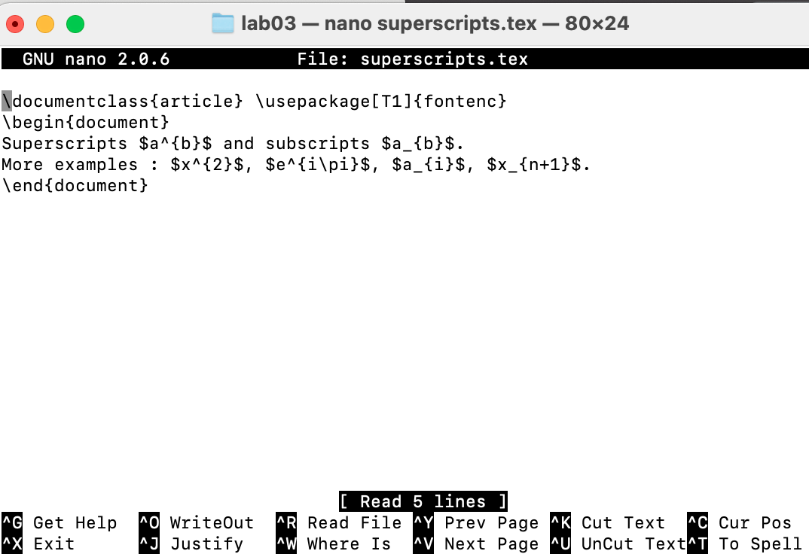
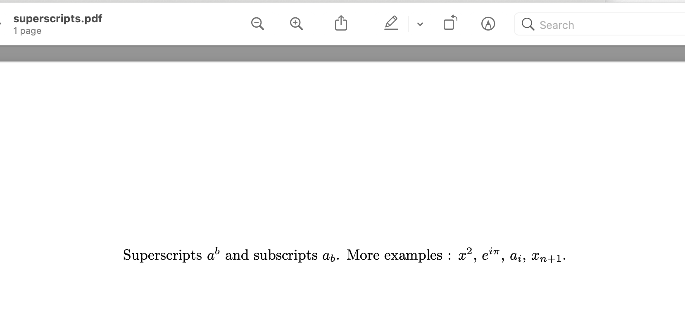

# Математический набор в LaTeX

## Лабораторная работа №3

### Надиа Эззакат

---

# Содержание

1. Inline математика
2. Display математика
3. Индексы и степени
4. Греческие буквы
5. Интегралы
6. Матрицы
7. Шрифты

---

# Inline математика

На этой картинке показано, как писать формулы внутри текста.

{ width=70% }

---

# Display математика

На этой картинке показано, как писать формулы на отдельной строке.

{ width=70% }

---

# Индексы и степени

На первой картинке показан код для индексов и степеней.
На второй картинке показан результат.

{ width=70% }

{ width=70% }

---

# Греческие буквы

На первой картинке показан код для греческих букв.
На второй картинке показан результат.

{ width=70% }

{ width=70% }

---

# Интегралы

На этой картинке показано, как писать интегралы.

{ width=70% }

---

# Матрицы

На этой картинке показано, как создавать матрицы.

{ width=70% }

---

# Математические шрифты

На этой картинке показаны разные математические шрифты.

{ width=70% }

---

# Выводы

В этой работе я научилсась:

- Писать формулы в LaTeX
- Использовать индексы и степени
- Использовать греческие буквы
- Писать интегралы
- Создавать матрицы

---

# Спасибо за внимание!
