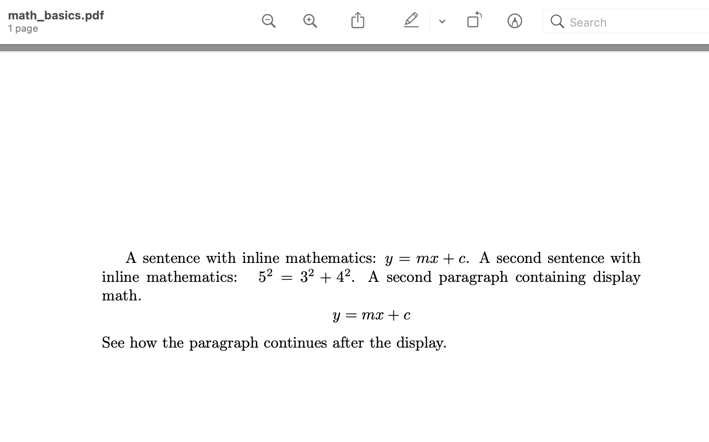
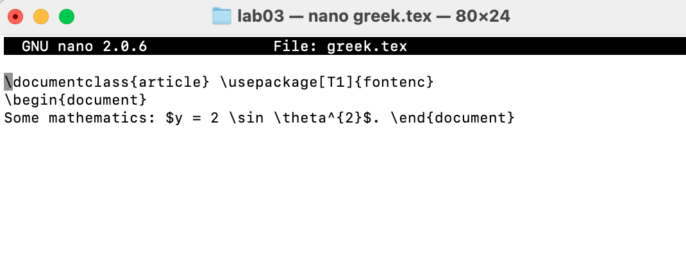
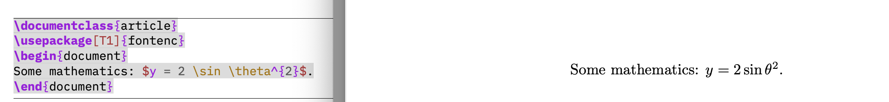
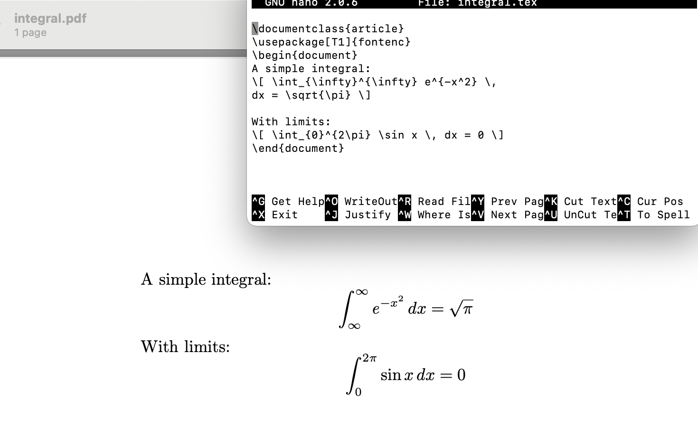
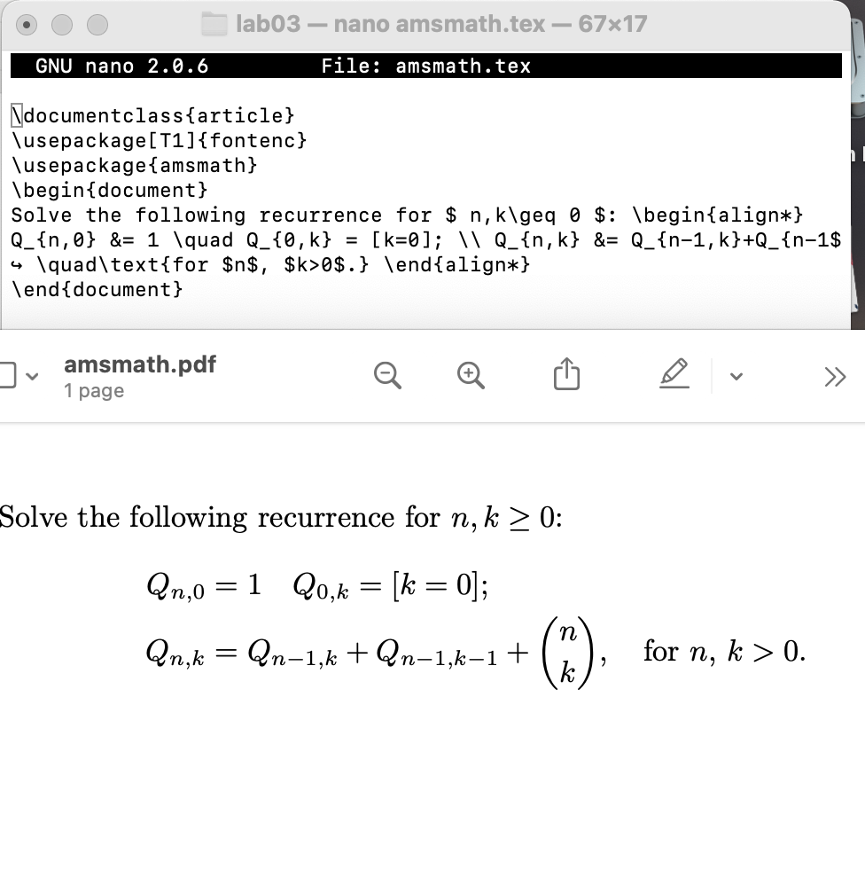
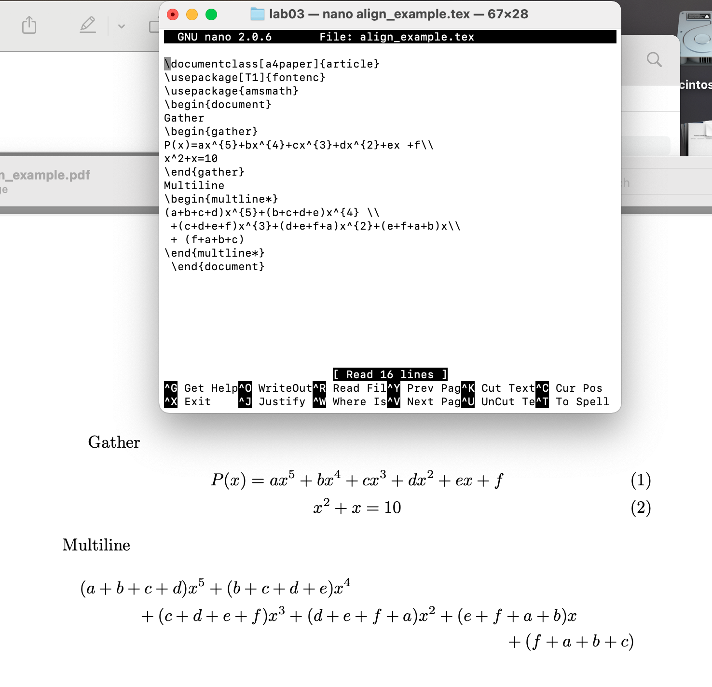
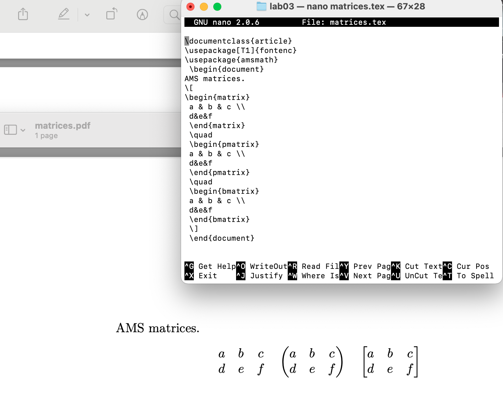
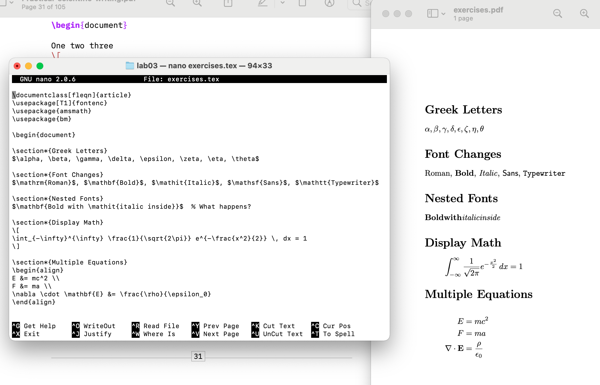

---
# Front matter
lang: ru-RU
title: "Лабораторная работа №3"
subtitle: "Математический набор в LaTeX"
author: "Надиа Эззакат"

# Formatting
toc-title: "Содержание"
toc: true
toc_depth: 2
lof: true
lot: true
fontsize: 12pt
linestretch: 1.5
papersize: a4paper
documentclass: scrreprt
polyglossia-lang: russian
polyglossia-otherlangs: english
mainfont: PT Serif
romanfont: PT Serif
sansfont: PT Sans
monofont: PT Mono
mainfontoptions: Ligatures=TeX
romanfontoptions: Ligatures=TeX
sansfontoptions: Ligatures=TeX,Scale=MatchLowercase
monofontoptions: Scale=MatchLowercase
indent: true
pdf-engine: lualatex
header-includes:
  - \linepenalty=10
  - \interlinepenalty=0
  - \hyphenpenalty=50
  - \exhyphenpenalty=50
  - \binoppenalty=700
  - \relpenalty=500
  - \clubpenalty=150
  - \widowpenalty=150
  - \displaywidowpenalty=50
  - \brokenpenalty=100
  - \predisplaypenalty=10000
  - \postdisplaypenalty=0
  - \floatingpenalty = 20000
  - \raggedbottom
  - \usepackage{float}
  - \floatplacement{figure}{H}
  - \usepackage{amsmath, amssymb, amsfonts}
  - \usepackage{bm}
---

# Цель работы

Освоить основные возможности LaTeX для набора математических формул, изучить различные режимы математического набора и научиться работать с пакетом amsmath.

# Задание

1. Изучить inline и display режимы математического набора
2. Освоить работу с индексами и степенями
3. Научиться набирать греческие буквы и математические функции
4. Изучить многострочные формулы с выравниванием
5. Освоить работу с матрицами
6. Изучить различные шрифты в математическом режиме
7. Научиться использовать жирный шрифт для математических символов

# Теоретическое введение

LaTeX предоставляет мощные возможности для набора математических формул. Основные понятия включают:

- **Математический режим** — специальное состояние LaTeX для набора формул
- **Inline математика** — формулы внутри текста (обозначается $...$)
- **Display математика** — выключные формулы (обозначается \[...\])

Пакет **amsmath** расширяет базовые возможности и предоставляет дополнительные окружения для многострочных формул, матриц и других математических конструкций.

# Выполнение лабораторной работы

## 1. Inline и Display математика

{ width=70% }

## 2. Индексы и степени
{ width=70% }

{ width=70% }

Код для этого примера:

## 3. Греческие буквы
{ width=70% }

{ width=70% }

## 4. Интегралы и суммы
{ width=70% }
## 5. Многострочные формулы
{ width=70% }

{ width=80% }

## 6. Матрицы
{ width=70% }

## 7. Различные шрифты в математике
Для этого раздела были изучены различные шрифты:

## 8. Жирный шрифт в математике
{ width=70% }

# Выводы
В ходе выполнения лабораторной работы были изучены основные возможности LaTeX для математического набора:

- **Inline и display режимы** — для вставки формул внутри текста и в отдельные строки
- **Индексы и степени** — с помощью символов `_` и `^`
- **Греческие буквы** — команды вида `\alpha`, `\beta`, и т.д.
- **Математические функции** — `$\sin$`, `$\cos$`, `$\log$` и другие
- **Интегралы и суммы** — `$\int$`, `$\sum$`, `$\prod$`
- **Многострочные формулы** — окружение `align*` из пакета amsmath
- **Матрицы** — окружения `pmatrix`, `bmatrix`, `vmatrix`
- **Различные шрифты** — `$\mathrm$`, `$\mathbf$`, `$\mathit$`, `$\mathbb$`, `$\mathcal$`
- **Жирные символы** — пакет `bm` и команда `$\bm{}$`

Полученные навыки позволяют создавать профессионально оформленные математические документы любой сложности.
# Список литературы
Кулябов Д. С., Королькова А. В., Геворкян М. Н. Practical scientific writing. — 2024.

LaTeX documentation: https://www.latex-project.org/help/documentation/

AMS Math documentation: https://www.ams.org/publications/authors/tex/amslatex
