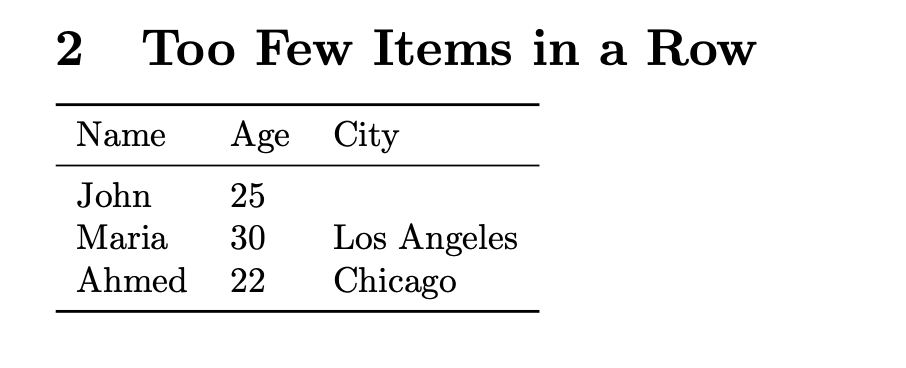
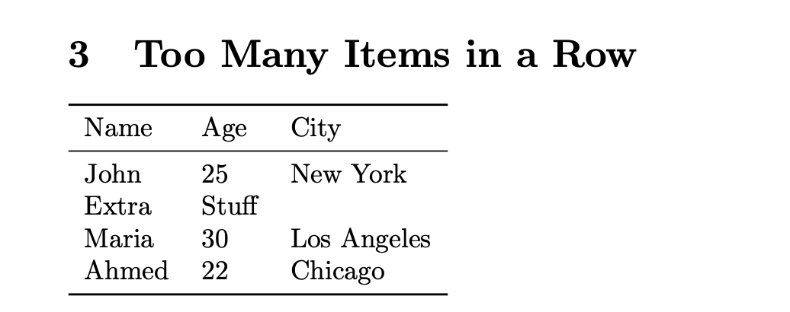

---
## Front matter
lang: ru-RU
title: Лабораторной работе №5
subtitle: Таблицы в LaTeX
author: Надиа Эззакат
institute: РУДН, Москва, Россия
date: 13 Марта 2026

## Formatting
toc: false
slide_level: 2
theme: metropolis
header-includes: 
 - \metroset{progressbar=frametitle,sectionpage=progressbar,numbering=fraction}
 - '\makeatletter'
 - '\beamer@ignorenonframefalse'
 - '\makeatother'
aspectratio: 43
section-titles: true
---

# Цель работы

Изучение основ создания таблиц в LaTeX:

- Освоение различных типов выравнивания колонок
- Исследование поведения LaTeX при некорректном количестве элементов в строках
- Приобретение навыков использования команды \multicolumn для объединения ячеек

# Задачи

1. Создать таблицы с различными типами выравнивания: l, c, r
2. Экспериментально проверить реакцию LaTeX на недостаточное количество элементов в строке
3. Экспериментально проверить реакцию LaTeX на избыточное количество элементов в строке
4. Применить команду \multicolumn для создания заголовков, объединяющих несколько колонок

# Выравнивание влево (l)

При использовании левого выравнивания текст в колонках прижимается к левому краю.

# Выравнивание по центру (c)

При использовании центрирования текст располагается по центру каждой колонки.

# Выравнивание вправо (r)

При использовании правого выравнивания текст прижимается к правому краю колонок.

# Недостаточное количество элементов

При указании меньшего количества элементов, чем определено колонок, происходит смещение данных в неправильные колонки. LaTeX выдает ошибку, но PDF создается.

# Избыточное количество элементов

При указании большего количества элементов, чем определено колонок, лишние элементы выводятся за пределами таблицы. LaTeX выдает ошибку, но компиляция продолжается.

# Использование \multicolumn

## Объединение двух колонок

Команда `\multicolumn{2}{c}{Personal Info}` создает заголовок, объединяющий первые две колонки.

# Использование \multicolumn

## Объединение всех трех колонок

Команда `\multicolumn{3}{c}{Student Database}` создает заголовок, объединяющий все колонки таблицы.

# Выводы

В ходе выполнения лабораторной работы были получены следующие результаты:

1. Освоены три типа выравнивания колонок: l (влево), c (по центру), r (вправо)
2. Исследовано поведение LaTeX при некорректном количестве элементов в строках
3. Изучена команда textbackslash \multicolumn для объединения ячеек по горизонтали
4. Приобретены практические навыки создания профессиональных таблиц с использованием пакетов array и booktabs

# Список литературы

1. Кулябов Д.С., Королькова А.В., Геворкян М.Н. Practical scientific writing. - РУДН, 2025.
2. CTAN: The Comprehensive TeX Archive Network. Пакет array.
3. CTAN: The Comprehensive TeX Archive Network. Пакет booktabs.
