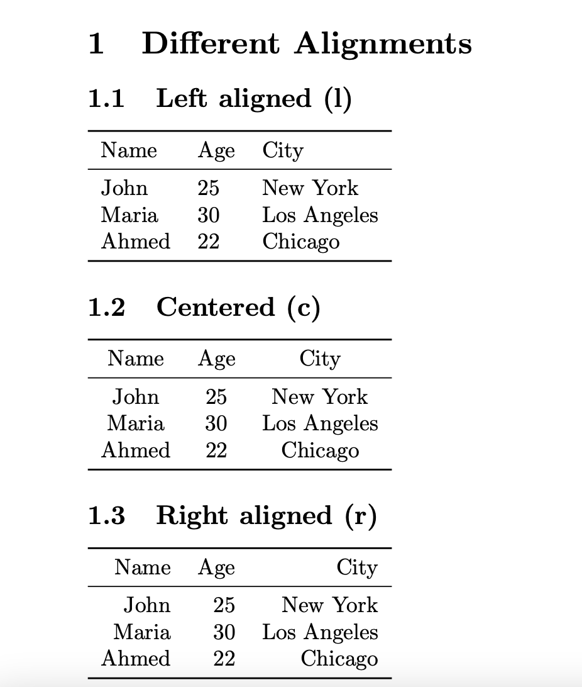
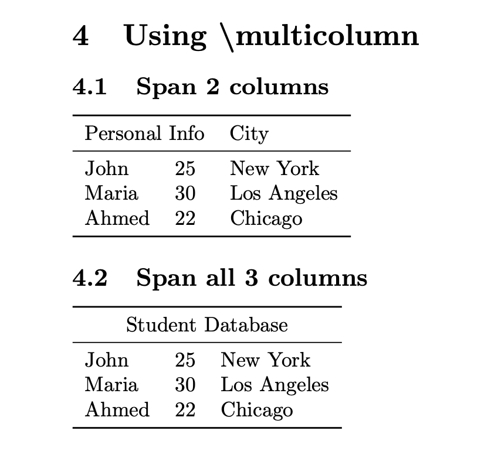

---
# Front matter
lang: ru-RU
title: "Лабораторная работа №5"
subtitle: "Дисциплина: Компьютерный практикум по научному письму"
author: "Надиа Эззакат"

# Formatting
toc-title: "Содержание"
toc: true # Table of contents
toc_depth: 2
lof: true # Список рисунков
lot: true # Список таблиц
fontsize: 12pt
linestretch: 1.5
papersize: a4paper
documentclass: scrreprt
polyglossia-lang: russian
polyglossia-otherlangs: english
mainfont: PT Serif
romanfont: PT Serif
sansfont: PT Sans
monofont: PT Mono
mainfontoptions: Ligatures=TeX
romanfontoptions: Ligatures=TeX
sansfontoptions: Ligatures=TeX,Scale=MatchLowercase
monofontoptions: Scale=MatchLowercase
indent: true
pdf-engine: lualatex
header-includes:
  - \linepenalty=10 # the penalty added to the badness of each line within a paragraph (no associated penalty node) Increasing the value makes tex try to have fewer lines in the paragraph.
  - \interlinepenalty=0 # value of the penalty (node) added after each line of a paragraph.
  - \hyphenpenalty=50 # the penalty for line breaking at an automatically inserted hyphen
  - \exhyphenpenalty=50 # the penalty for line breaking at an explicit hyphen
  - \binoppenalty=700 # the penalty for breaking a line at a binary operator
  - \relpenalty=500 # the penalty for breaking a line at a relation
  - \clubpenalty=150 # extra penalty for breaking after first line of a paragraph
  - \widowpenalty=150 # extra penalty for breaking before last line of a paragraph
  - \displaywidowpenalty=50 # extra penalty for breaking before last line before a display math
  - \brokenpenalty=100 # extra penalty for page breaking after a hyphenated line
  - \predisplaypenalty=10000 # penalty for breaking before a display
  - \postdisplaypenalty=0 # penalty for breaking after a display
  - \floatingpenalty = 20000 # penalty for splitting an insertion (can only be split footnote in standard LaTeX)
  - \raggedbottom # or \flushbottom
  - \usepackage{float} # keep figures where there are in the text
  - \floatplacement{figure}{H} # keep figures where there are in the text
---

# Цель работы

Познакомиться с созданием таблиц в LaTeX, изучить различные типы выравнивания колонок, исследовать поведение LaTeX при неправильном количестве элементов в строках таблицы, а также освоить использование команды `\multicolumn` для объединения ячеек.

# Задание

1. Изучить базовую структуру таблиц в LaTeX с использованием пакетов array и booktabs

2. Исследовать различные типы выравнивания колонок: l (влево), c (по центру), r (вправо)

3. Экспериментально проверить поведение LaTeX при:
   - Недостаточном количестве элементов в строке
   - Избыточном количестве элементов в строке

4. Освоить команду `\multicolumn` для объединения ячеек по горизонтали

# Выполнение лабораторной работы

## 1. Изучение различных типов выравнивания колонок

Для создания таблиц в LaTeX используются пакеты array и booktabs. Пакет booktabs предоставляет команды для создания профессиональных горизонтальных линий: `\toprule`, `\midrule` и `\bottomrule`.

### 1.1 Выравнивание влево (l)

При использовании левого выравнивания весь текст в колонках прижимается к левому краю:

$$ \text{Столбец 1 (l)} = \text{текст прижат влево} $$

$$ \text{Столбец 2 (l)} = \text{текст прижат влево} $$

$$ \text{Столбец 3 (l)} = \text{текст прижат влево} $$

### 1.2 Выравнивание по центру (c)

При использовании центрирования текст располагается по центру каждой колонки:

{ width=70% }

### 1.3 Выравнивание вправо (r)

При использовании правого выравнивания текст прижимается к правому краю колонок:

{ width=70% }

**Наблюдение:** Выбор типа выравнивания (`l`, `c`, `r`) существенно влияет на визуальное восприятие таблицы и может улучшить читаемость данных в зависимости от их типа.

## 2. Эксперименты с количеством элементов в строках

### 2.1 Недостаточное количество элементов в строке

При создании таблицы с тремя колонками, если в строке указано меньше элементов (в данном случае только "John" и "25" без города):

{ width=70% }

**Результат:** LaTeX выдает ошибку, но PDF-файл все равно создается. Строка с недостаточными элементами (John) завершается преждевременно, что приводит к смещению последующих данных в неправильные колонки. Обратите внимание, как "Los Angeles" появляется под колонкой Age для John, а выравнивание остальных строк нарушается.

### 2.2 Избыточное количество элементов в строке

При указании большего количества элементов, чем определено колонок (добавлены "Extra" и "Stuff"):

{ width=70% }

**Результат:** LaTeX генерирует ошибку, но компиляция продолжается. Дополнительные элементы ("Extra" и "Stuff") выводятся за пределами структуры таблицы, появляясь как отдельный контент под таблицей, что нарушает предполагаемый макет.

## 3. Использование команды \multicolumn

Команда `\multicolumn` позволяет объединять несколько колонок в одну, что полезно для создания заголовков и группировки данных.

### 3.1 Объединение 2 колонок

Создание заголовка, объединяющего первые две колонки:

{ width=70% }

**Использованный код:** `\multicolumn{2}{c}{Personal Info}`

### 3.2 Объединение всех 3 колонок

Создание заголовка, объединяющего все три колонки таблицы:

{ width=70% }

**Использованный код:** `\multicolumn{3}{c}{Student Database}`

**Наблюдение:** Команда `\multicolumn{n}{align}{text}` принимает три параметра:
- `n`: количество объединяемых колонок
- `align`: выравнивание (l, c или r)
- `text`: отображаемый текст

Эта команда особенно полезна для создания иерархических заголовков и визуальной группировки связанных колонок.

# Выводы

В ходе выполнения лабораторной работы были получены практические навыки работы с таблицами в LaTeX:

1. **Освоены типы выравнивания колонок** (`l`, `c`, `r`), которые позволяют управлять позиционированием текста в таблицах.

2. **Исследована обработка ошибок** при неправильном количестве элементов в строках:
   - При недостаточном количестве элементов данные смещаются в неправильные колонки
   - При избыточном количестве элементы выводятся за пределами таблицы
   - LaTeX предоставляет информативные сообщения об ошибках для диагностики проблем

3. **Изучена команда `\multicolumn`**, которая необходима для создания объединенных ячеек и иерархических заголовков, улучшающих структурирование данных.

4. **Применены профессиональные пакеты** array и booktabs, которые предоставляют расширенные возможности для создания качественных таблиц в научных документах.

Полученные навыки являются фундаментальными для создания профессиональных научных документов с четкой и структурированной презентацией табличных данных.
