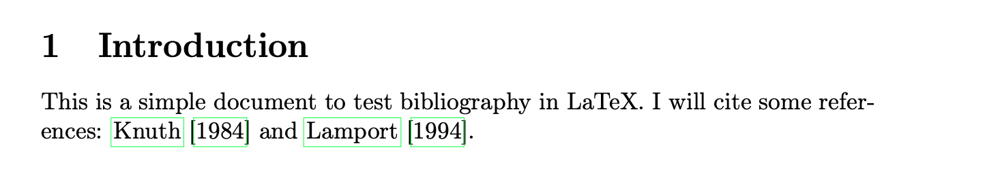

---
## Front matter
lang: ru-RU
title: Лабораторной работе №6
subtitle: Работа с библиографией в LaTeX
author: Надиа Эззакат
institute: РУДН, Москва, Россия
date: 13 Марта 2026

## Formatting
toc: false
slide_level: 2
theme: metropolis
header-includes: 
 - \metroset{progressbar=frametitle,sectionpage=progressbar,numbering=fraction}
 - '\makeatletter'
 - '\beamer@ignorenonframefalse'
 - '\makeatother'
aspectratio: 43
section-titles: true
---

## Цель работы

Изучение основ работы с библиографией в LaTeX:

- Создание и управление библиографическими базами данных
- Освоение различных команд цитирования
- Понимание процесса компиляции документов с библиографией

## Задачи

1. Создать BibTeX файл с参考文献
2. Использовать пакет natbib для цитирования
3. Изучить команды \textbackslash citet и \textbackslash citep
4. Освоить многоэтапный процесс компиляции
5. Получить автоматически отформатированный список литературы

## Файлы, созданные в ходе работы

- `lab06.tex` - основной LaTeX документ с цитированиями
- `references.bib` - база данных библиографии

## Библиографическая база данных
@book{knuth1984,
author = {Knuth, Donald E.},
title = {The TeXbook},
publisher = {Addison-Wesley},
year = {1984}
}

@book{lamport1994,
author = {Lamport, Leslie},
title = {LaTeX: A Document Preparation System},
publisher = {Addison-Wesley},
year = {1994}
}

@book{goossens1993,
author = {Goossens, Michel and Mittelbach, Frank and Samarin, Alexander},
title = {The LaTeX Companion},
publisher = {Addison-Wesley},
year = {1993}
}

text

## Процесс компиляции

Для создания документа с библиографией требуется несколько шагов:

1. `pdflatex lab06.tex` - создает .aux файл с информацией о цитированиях
2. `bibtex lab06` - читает .aux и .bib, создает .bbl файл
3. `pdflatex lab06.tex` (дважды) - включает библиографию и разрешает ссылки

## Результаты: Цитаты в тексте

## Результаты: Дополнительные примеры

## Результаты: Сгенерированная библиография

## Команды цитирования

| Команда | Результат |
|---------|-----------|
| `\citet{knuth1984}` | Текстовое цитирование: Knuth (1984) |
| `\citep{lamport1994}` | Цитирование в скобках: (Lamport, 1994) |
| `\citep[p.~42]{knuth1984}` | Цитирование с номером страницы: (Knuth, 1984, p. 42) |
| `\citep{knuth1984,lamport1994}` | Множественные цитирования: (Knuth, 1984; Lamport, 1994) |

## Наблюдения

- `\citet` создает текстовые цитирования (автор как часть предложения)
- `\citep` создает цитирования в скобках (автор в круглых скобках)
- BibTeX автоматически форматирует все ссылки единообразно
- Стиль `plainnat` организует ссылки в алфавитном порядке по автору

## Выводы

В ходе лабораторной работы я научился(ась):

- Создавать .bib файл с参考文献
- Использовать различные команды цитирования в natbib
- Понимать многоэтапный процесс компиляции библиографии
- Автоматически форматировать список литературы в LaTeX

Система библиографии в LaTeX экономит время и обеспечивает единообразное форматирование ссылок.

## Список литературы

1. Кулябов Д.С., Королькова А.В., Геворкян М.Н. Practical scientific writing. - РУДН, 2025.
2. CTAN: The Comprehensive TeX Archive Network. Пакет natbib.
3. CTAN: The Comprehensive TeX Archive Network. Пакет bibtex.
