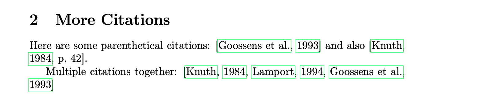
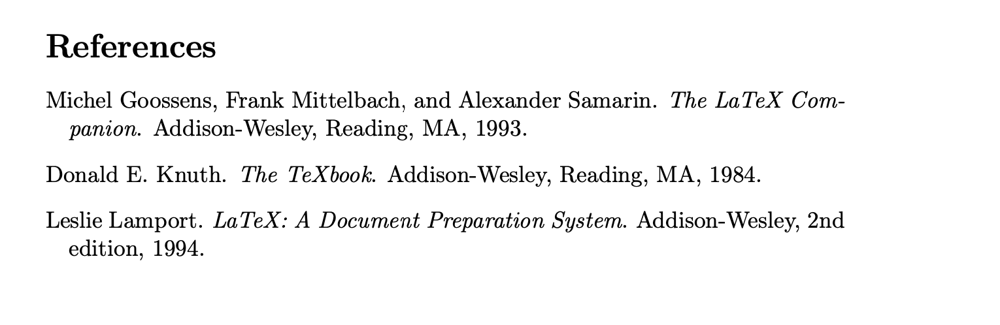

# Lab 06 Report: Bibliography in LaTeX
**Nadia Ezzakate** | March 13, 2026

## Objective
To learn how to create and manage bibliographies in LaTeX using BibTeX and the natbib package.

## Files Created
- `lab06.tex` - Main LaTeX document with citations
- `references.bib` - Bibliography database with references

## Bibliography Database (references.bib)
@book{knuth1984,
author = {Knuth, Donald E.},
title = {The TeXbook},
publisher = {Addison-Wesley},
year = {1984}
}

@book{lamport1994,
author = {Lamport, Leslie},
title = {LaTeX: A Document Preparation System},
publisher = {Addison-Wesley},
year = {1994}
}

@book{goossens1993,
author = {Goossens, Michel and Mittelbach, Frank and Samarin, Alexander},
title = {The LaTeX Companion},
publisher = {Addison-Wesley},
year = {1993}
}

text

## Compilation Process
To create a document with bibliography, we need multiple compilation steps:

1. `pdflatex lab06.tex` - Creates .aux file with citation info
2. `bibtex lab06` - Reads .aux and .bib, creates .bbl file
3. `pdflatex lab06.tex` (twice) - Incorporates bibliography and resolves references

## Results

### Citations in the Text

### More Citation Examples

### Generated Bibliography

## Citation Commands

| Command | Result |
|---------|--------|
| `\citet{knuth1984}` | Textual citation: Knuth (1984) |
| `\citep{lamport1994}` | Parenthetical citation: (Lamport, 1994) |
| `\citep[p.~42]{knuth1984}` | Citation with page number: (Knuth, 1984, p. 42) |
| `\citep{knuth1984,lamport1994}` | Multiple citations: (Knuth, 1984; Lamport, 1994) |

## Observations
- `\citet` produces textual citations (author as part of sentence)
- `\citep` produces parenthetical citations (author in parentheses)
- BibTeX automatically formats all references consistently
- The `plainnat` style organizes references alphabetically by author

## Conclusion
In this lab, I learned:
- How to create a .bib file with references
- Different citation commands in natbib
- The multi-step compilation process for bibliography
- How LaTeX automatically formats references

The bibliography system in LaTeX saves time and ensures consistent formatting of references.

