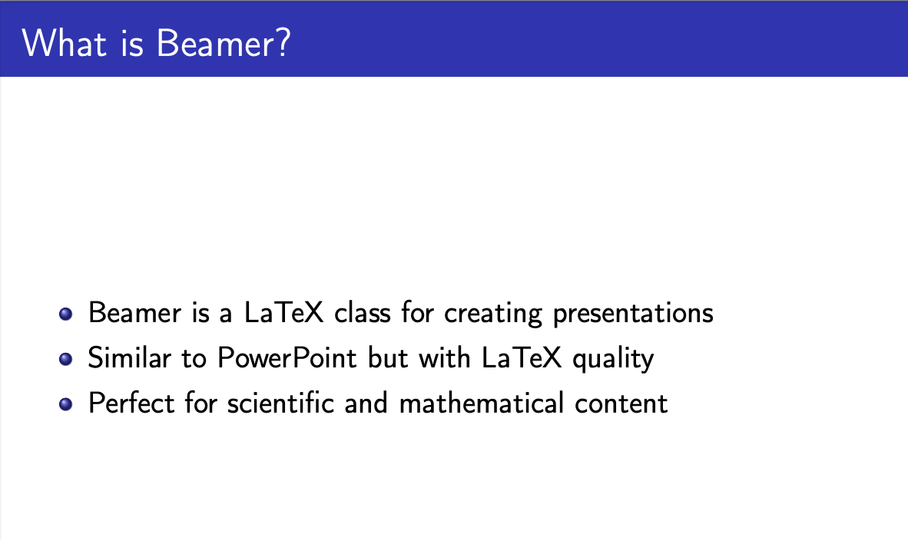
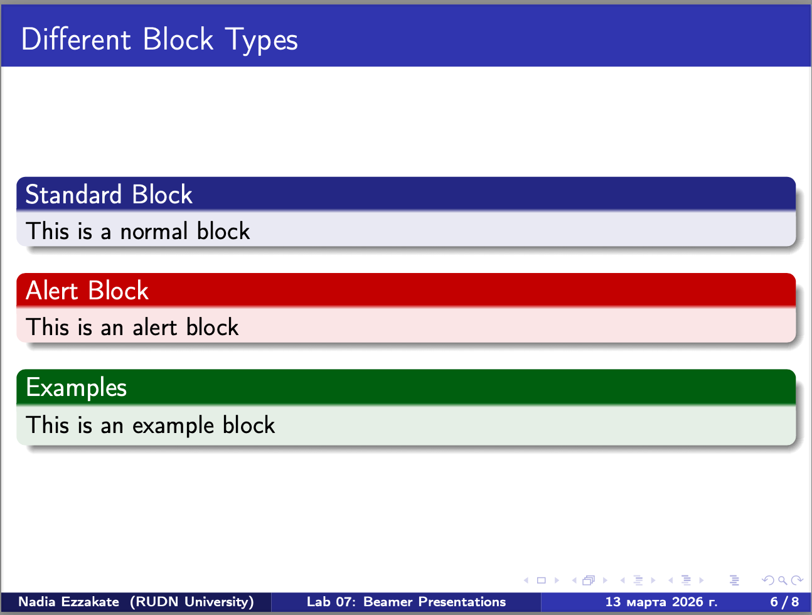

# Лабораторная работа №7
## Создание презентаций в Beamer

**Надиа Эззакат**
РУДН, Москва
13 марта 2026

---

## Цель работы

Изучение возможностей класса Beamer в LaTeX для создания презентаций.

---

## Структура презентации

- Титульный слайд
- Оглавление
- Введение
- Возможности Beamer
- Блоки
- Колонки
- Математические формулы
- Заключение

---

## Оглавление

*Автоматическое оглавление на основе разделов*

---

## Введение

*Что такое Beamer и зачем он нужен*

---

## Возможности Beamer

*Ключевые возможности: темы, блоки, колонки, математика*

---

## Математические формулы

*Примеры уравнений:*
- $E = mc^2$
- $\sum_{i=1}^n i = \frac{n(n+1)}{2}$

---

## Блоки в Beamer

*Три типа блоков:*
- Обычный блок (block)
- Блок-предупреждение (alertblock)
- Блок-пример (examples)

---

## Колонки в Beamer

*Двухколоночный макет для сравнения информации*

---

## Выводы

В ходе работы было изучено:

- Создание слайдов с помощью `frame`
- Использование различных тем оформления
- Работа с блоками (`block`, `alertblock`, `examples`)
- Создание многоколоночных макетов (`columns`)
- Вставка математических формул

Beamer позволяет создавать профессиональные научные презентации с качественным форматированием.

---

## Спасибо за внимание!

