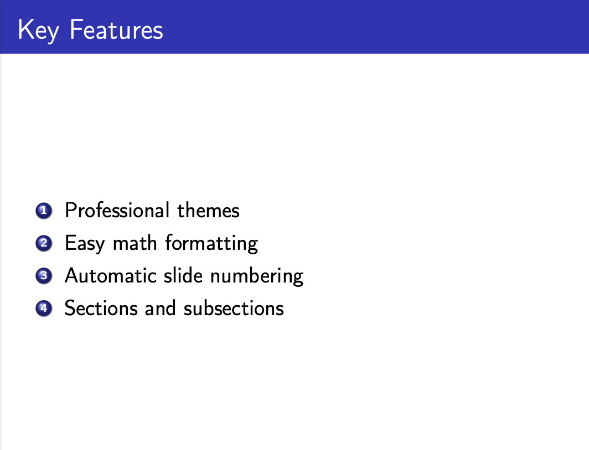
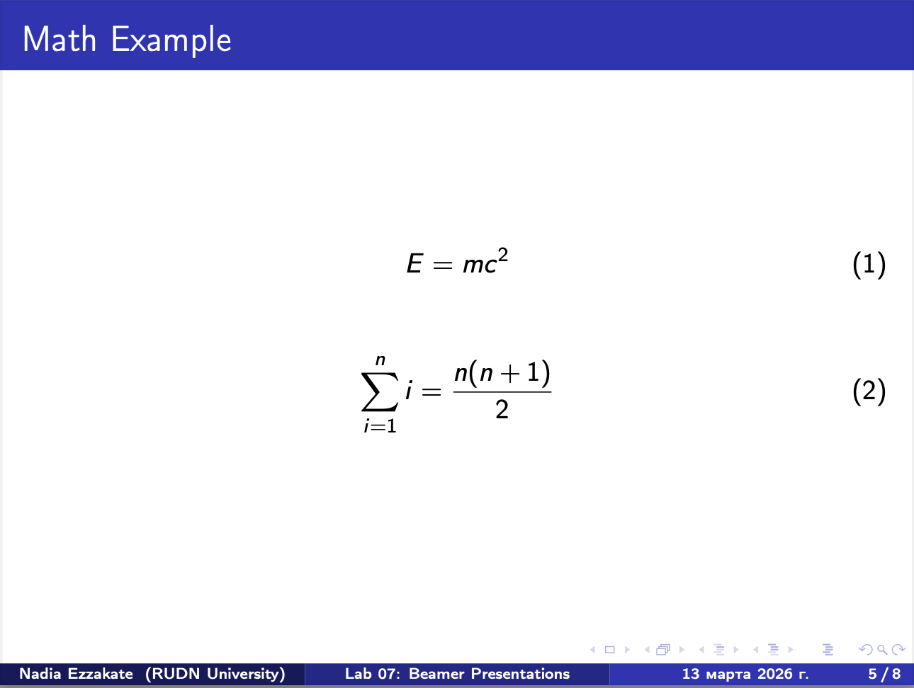
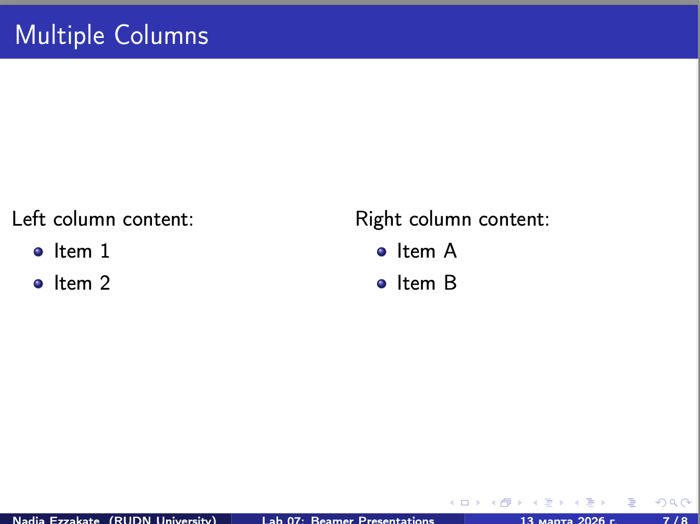

# Отчет по лабораторной работе №7
## Создание презентаций в Beamer

**Выполнил(а):** Надиа Эззакат  
**Дата:** 13 марта 2026  
**Институт:** РУДН, Москва

## 1. Цель работы
Целью данной лабораторной работы является изучение возможностей класса Beamer в LaTeX для создания профессиональных презентаций.

## 2. Выполнение работы

### 2.1 Структура презентации
Была создана презентация со следующей структурой:
- Титульный слайд
- Слайд с оглавлением
- Раздел "Введение"
- Раздел "Возможности"
- Раздел "Блоки"
- Раздел "Колонки"

### 2.2 Результаты

#### Слайд с оглавлением

#### Слайд с введением

#### Слайд с возможностями

#### Слайд с математикой

#### Слайд с блоками

#### Слайд с колонками

## 3. Выводы
В ходе работы были изучены основные возможности Beamer:
- Создание слайдов с помощью frame
- Использование различных тем оформления
- Работа с блоками (block, alertblock, examples)
- Создание многоколоночных макетов
- Вставка математических формул
